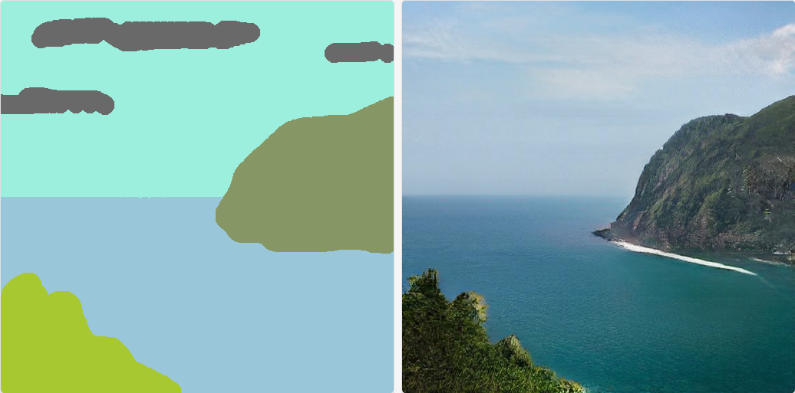
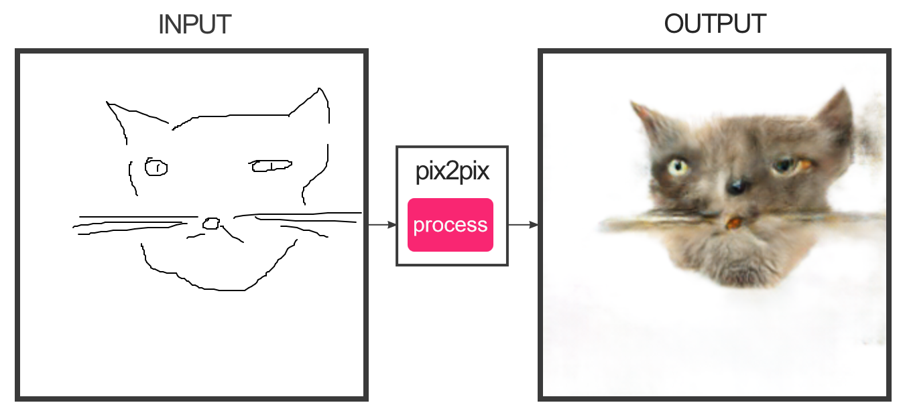
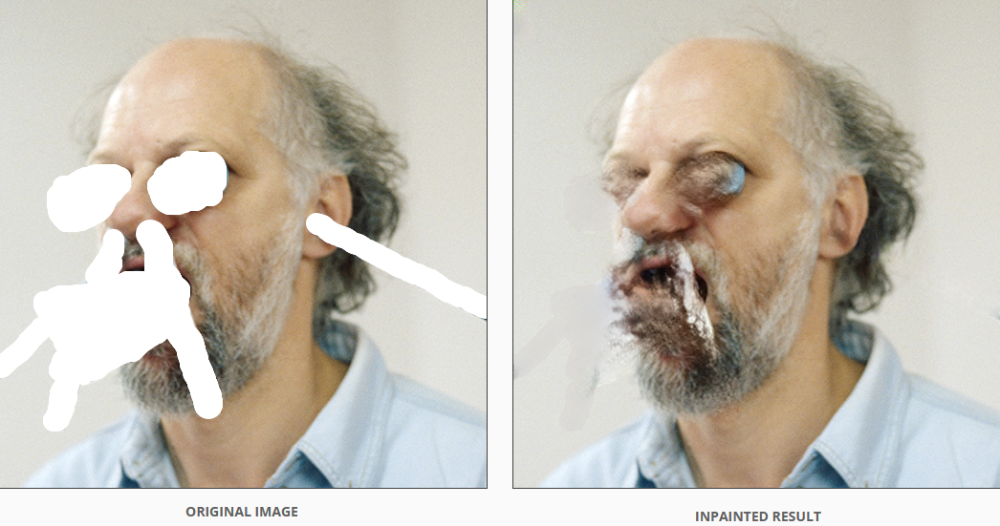

# Новости машинного обучения. Выпуск 7

[Опубликовано на Хабре](https://habr.com/ru/news/t/484354)

[Предыдущий выпуск](2020.01.07-novosti-mashinnogo-obucheniya-vypusk-6.md)

Новости ML, новые технологии, идеи по применению и гипотезы.

Изображение сделано в [Nvidia GauGan](http://nvidia-research-mingyuliu.com/gaugan). [Видео](https://youtu.be/NKFrg9HMYaY), [статья и исходный код](https://paperswithcode.com/paper/semantic-image-synthesis-with-spatially). 

  * Видео [AI in 2020](https://youtu.be/eN9Lb3vXsAw) от Siraj Raval, а также [AI in 2020](https://youtu.be/6SWpN64Ivb4) от Henry AI Labs во многом пересекается [с моими](https://habr.com/ru/post/482794/) прогнозами.
  * Готовится к выпуску интересный видеокурс: **нейронные сети с нуля** [Neural Networks from Scratch](https://youtu.be/G7RDn8Xtf_Y). Без использования каких-либо сторонних библиотек. Только хардкор, только Python! Без библиотеки NumPy в первой версии и с NumPy во второй. Уже есть мини курс [Neural Networks Demystified](https://www.youtube.com/playlist?list=PLiaHhY2iBX9hdHaRr6b7XevZtgZRa1PoU) + [код](https://github.com/stephencwelch/Neural-Networks-Demystified), однако там только 6 нейронов с одним стрытым слоем и объясняется самая основа. Кроме видео курса будет выпущена книга примерно на 300 страниц. Подписывайтесь, донатьте, следите за выходом новых серий курса. Сайт этого специалиста со множеством различных руководств: [https://pythonprogramming.net](https://pythonprogramming.net/).
  * [Несколько методов отслеживания (трекинга) объектов](https://youtu.be/n_z6SY3UYB0?t=4). В самом начале этого видео даются ссылки на 7 методов: TFOS, TFOS+, EMT, HBT, SPT, IVT, TLD. Также интересен метод остлеживания единичного объекта под названием [PySOT](https://github.com/STVIR/pysot) с открытым исходным кодом. ПО PySOT основана на алгоритмах [SiamRPN](http://openaccess.thecvf.com/content_cvpr_2018/html/Li_High_Performance_Visual_CVPR_2018_paper.html) и [SiamMask](https://arxiv.org/abs/1812.05050) и использует библиотеку [PyTorch](https://pytorch.org/) в качестве машинного обучения. Примечание: автор не использовал данные алгоритмы на практике.
  * [Бионические роботы](https://youtu.be/ooqiY7hFWE8) от Festo Robotics для вдохновения. 5 моделей: рука, стрекоза, муравьи, кисть, язык хамелеона. К бионическим роботам относится решение кубика Рубика с помощью [руки робота](https://youtu.be/x4O8pojMF0w) ([статья](https://arxiv.org/abs/1910.07113), [полное видео](https://youtu.be/kVmp0uGtShk)).
  * [Talk to Transformer](https://talktotransformer.com/) автоматическое завершение абзаца текста. Для русского языка плохо работает.
  * [Top 10 Deep Learning tools](https://medium.com/@chengweizhang2012/top-10-deep-learning-experiences-run-on-your-browser-458a64c9625f) — ссылки на десять приложений по глубокому обучению онлайн.
  * [Nvidia Playground](https://www.nvidia.com/en-us/research/ai-playground/) содержит три демонстрационных приложения, которые можно использовать онлайн без установки и настройки.
  * Для начинающих изучать язык программирования JavaScript есть приложение [grasshopper.app](https://grasshopper.app). Обучаться можно на телефоне, планшете или ПК. Упражнения сделаны в игровой форме, поэтому проходить интересно даже тем, кто умеет программировать. Автор прошел почти все упражнения и ему понравилось.

Рисование котов из ада [тут](https://affinelayer.com/pixsrv/). Еще программы для рисования [Neural Doodle](https://github.com/alexjc/neural-doodle) ([видео](https://youtu.be/jMZqxfTls-0) и [код](https://github.com/alexjc/neural-doodle)) и [Feed-forward neural doodle](https://dmitryulyanov.github.io/feed-forward-neural-doodle/) ([код](https://github.com/DmitryUlyanov/online-neural-doodle)).

Полезные ссылки собираю [сюда](https://github.com/foobar167/articles/blob/master/Ubuntu/13_Keras_and_TensorFlow_how-tos.md/#websites) и стараюсь, чтобы их не было слишком много:
  * [Papers With Code](https://paperswithcode.com/task/object-detection) — научные статьи по машинному обучению, исходный код и оценочные таблицы на одном веб-сайте. Удобно.
  * [ods.ai](https://ods.ai/) (Open Data Science) — Международное сообщество, объединяющее специалистов, исследователей и инженеров, связанных с Data Science. На сайте есть [топ открытых DS/ML проектов](https://ods.ai/awards/2019/), живущих и развивающихся в сообществе.
  * [pythonprogramming.net](https://pythonprogramming.net) — множество куководств по машинному обучению и не только + [видео блог](https://www.youtube.com/channel/UCfzlCWGWYyIQ0aLC5w48gBQ) автора.
  * [deeplearningweekly.com](https://www.deeplearningweekly.com/) — новостные рассылки по Глубокому Обучению каждую неделю (уже 125 выпусков), на английском. Новости более четкие и структурированные, чем данная седьмая рассылка.

Изображение сделано в [Nvidia Inpainting](https://www.nvidia.com/research/inpainting/) ([статья](https://heartbeat.fritz.ai/guide-to-image-inpainting-using-machine-learning-to-edit-and-correct-defects-in-photos-3c1b0e13bbd0) и [код](https://paperswithcode.com/task/image-inpainting)).

Спасибо за внимание!

**Теги:** машинное обучение, machine learning, нейросеть, искусственная нейронная сеть, artificial neural network, глубокое обучение, deep learning, Data Science, новости науки и техники, идеи для бизнеса, бизнес идеи, обработка изображений, научно-популярное, будущее здесь, визуализация данных, искусственный интеллект, 

**Хабы:** машинное обучение, обработка изображений, научно-популярное, визуализация данных, искусственный интеллект, будущее здесь,
