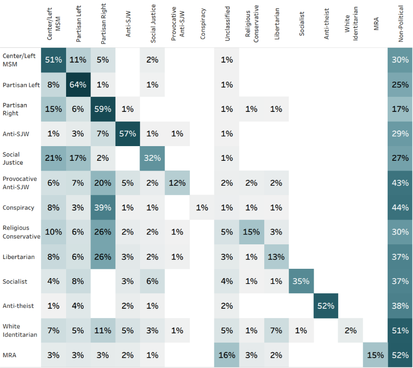

# Новости машинного обучения. Выпуск 8

[Опубликовано на Хабре](https://habr.com/ru/news/t/486730/)

[Предыдущий выпуск](2020.01.08-novosti-mashinnogo-obucheniya-vypusk-7.md)

Экзоскелеты; бионические протезы; промышленные роботы; исследование автоматических рекоммендаций Ютуба; создание моделей машинного обучения в браузере с помощью MediaPipe; виртуальная клавиатура для смартфонов; 5G; еще раз о сильном и слабом ИИ.

Рисунок 1 — Эти экзоскелеты [применяются на фабриках Форд](https://youtu.be/lWmFEoDjUc4), чтобы облегчить тяжелый физический труд на конвейере.

  * Внезапно, роботы [помогают играть в регби](https://youtu.be/AY6kawNvlLg), парализованный до пояса человек может [пробежать марафон](https://youtu.be/vBtXHGEezJA) благодаря экзоскелету, а [бионические протезы](https://youtu.be/3JT1mO0kPZw) позволяют людям двигаться свободнее. Вполне возможно, что роботы заберут часть наших работ ([«they took our jobs»](https://youtu.be/toL1tXrLA1c), Southpark), и это хорошо. Что делать, когда робот заберет вашу работу, смотрите [тут](https://youtu.be/-jeSitHw-lk).
  * Есть три вещи, на которые можно смотреть вечно: как течет вода, как горит огонь и как двигаются [промышленные роботы](https://youtu.be/t7D3dECjsio) на выставке «Automate 2019». [Топ-10](https://youtu.be/6L-V4xzUcmM) промышленных роботов вместо котиков.
  * Радикализация Ютуба через автоматические рекоммендации. Ютуб иногда советует посмотреть какую-то ненужную, но очень популярную, «дичь» из мейнстрима. По этому поводу вышла статья на английском под названием «[Алгоритмический экстремизм: изучение кроличьей норы радикализации на YouTube](https://arxiv.org/abs/1912.11211)». Автоматические рекомендации ведут к образованию «информационного пузыря» или [пузыря фильтров](https://ru.wikipedia.org/wiki/%D0%9F%D1%83%D0%B7%D1%8B%D1%80%D1%8C_%D1%84%D0%B8%D0%BB%D1%8C%D1%82%D1%80%D0%BE%D0%B2) вокруг зрителя, когда зрителю рекоммендуются схожие по содержанию видео снова и снова. Пузырь фильтров вреден не только из-за однотипности подаваемого материала, но, как показывает статья, имеет тенденцию радикализировать рекомендуемый контент. [Веб-приложение](https://www.recfluence.net/) с инфо-графикой. [Видео](https://youtu.be/K_MGWHiEeMk) автора статьи. [Видео](https://youtu.be/vB_hQ5NmtPs) интервью с автором статьи. [Исходный код](https://github.com/markledwich2/Recfluence) приложения под лицензией MIT и ежедневно обновляемые данные. Рекоммендации похожи на *«социальную сеть быстрого питания»* (фаст-фуд): вкусно и очень вредно для мозга (и для здоровья в целом). Отсюда рекоммендация: целенаправленно ищите информацию и лишь изредка бесцельно блуждайте по рекоммендуемым ссылкам.

Рисунок 2 — Таблица рекоммендаций для различных политических взглядов [в приложении к статье](https://arxiv.org/pdf/1912.11211.pdf)

  * Google перенесла модульный фреймворк машинного обучения в браузер. Новостная [статья](https://nplus1.ru/news/2020/01/30/mediapipe). Компания Google создала браузерную версию фреймворка [MediaPipe](https://arxiv.org/abs/1906.08172), позволяющего создавать и выполнять модульные алгоритмы машинного обучения, [сообщается](https://developers.googleblog.com/2020/01/mediapipe-on-web.html) в блоге Google Developers. Разработчики создали [сайт](https://viz.mediapipe.dev), на котором можно опробовать несколько базовых алгоритмов компьютерного зрения. Фреймворк MediaPipe простым образом объединяет базовые алгоритмы компьютерного зрения в конвейер, который развертывается на все основные платформы, без необходимости в адаптации под каждую из них в отдельности. В [GitHub](https://github.com/google/mediapipe) фреймворка есть примеры для: модели руки в реальном времени, сегментации волос; обнаружения и отслеживания объектов; обнаружения лиц и некоторые другие.
  * Samsung разработала виртуальную клавиатуру для смартфонов. Алгоритм основан на распознавании движений рук. [Видео](https://youtu.be/LRFvUYQ_SZ0) презентация. [Новость](https://nplus1.ru/news/2020/01/06/samsung) подробнее.
  * Видео «[Нейросетевые алгоритмы в приёмниках 5G](https://youtu.be/BKSQt-gWZjs)». Следующее поколение приемников 5G для интернета вещей ([IoT](https://youtu.be/QSIPNhOiMoE))
  * Видео о [сильном и слабом ИИ](https://youtu.be/GZ9kDSWjj7I). Определение искусственного интеллекта (ИИ), участие ИИ в конкурсе журнала «The Economist», автоматизация автоматизации и право на ошибку у робота.

Рисунок — Рука, как в Deus Ex, изготовленная стартапом [Open Bionics](https://youtu.be/luHmXHEpF7w)

Спасибо за внимание!

**Теги:** машинное обучение, machine learning, нейросеть, искусственная нейронная сеть, artificial neural network, глубокое обучение, deep learning, Data Science, новости науки и техники, идеи для бизнеса, бизнес идеи, обработка изображений, научно-популярное, будущее здесь, визуализация данных, искусственный интеллект, робототехника, бионический протез, экзоскелет,

**Хабы:** машинное обучение, обработка изображений, научно-популярное, искусственный интеллект, визуализация данных, будущее здесь, робототехника,
